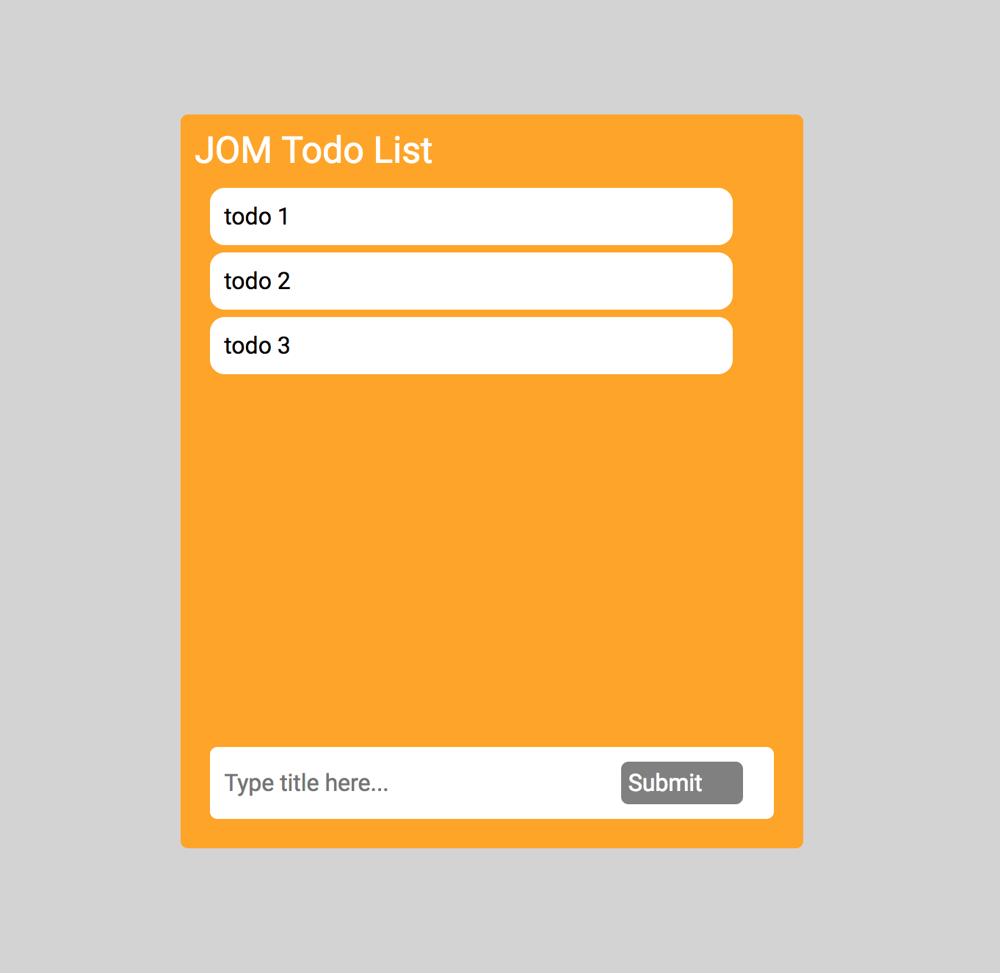

# JOM-Q
jQuery implementation using vanilla JS

## Usage

The basic api can be utilized via the following syntax:

` $JOM(arg) `

The argument's datatype determines the behavior and return value of the function.

### $JOM API

`$JOM(string)`

If the arg is a string, it will treat the arg as an HTML selector. Using the HTML selector, it will parse the DOM tree and return any HTML elements that match the selector.

The HTMLElements will be wrapped in a `NodeCollection` object, which has an API for manipulating the Nodes within the collection.

`$JOM(HTMLElement)`

If the arg is an HTMLElement, it will return the element wrapped in a `NodeCollection` object.

`$JOM(function)`

If the arg is a function, it will run the function after the DOM loads.

### NodeCollection API

#### html()
`$JOM().html(arg)`

If the arg is provided, all elements in the collection will have it's innerHTML replaced with the arg.

If no arg is provided, the innerHTML of the first element in the collection will be returned.

<!-- Usage Example: `$JOM('ul').html('<li>Hello World</li>')` -->

#### empty()

`$JOM().empty()`

empty() accepts no arguments, and clears the innerHTML of all elements in the collection.

#### append()
`$JOM().append(arg)`

if the arg is an instance of a NodeCollection, append() recursively checks all HTML elements in the arg and appends them to the current NodeCollection's innerHTML.

if the arg is an instance of an HTMLElement or String, it simply concatenates the arg to the end of the innerHTML of all elements in the collection.

#### addClass()

`$JOM().addClass(arg)`

If the arg is a String, it will append that class to the elements in the NodeCollection.

#### removeClass()
`$JOM().removeClass(arg)`

If the arg is a String, it will remove that class from all elements in the NodeCollection.

#### children()
`$JOM().children()`

No arguments are accepted, this returns all child elements of the elements in the NodeCollection.

The return value is a NodeCollection.

#### parent()
`$JOM().parent()`

No arguments are accepted, this returns all parent elements of the elements in the NodeCollection. Visited booleans are used to prevent multiple copies of the same parent from being in the return value.

The return value is a NodeCollection.

#### find()

`$JOM().find(selector)`

Using the selector, it finds any child elements in the NodeCollection.

#### remove()

`$JOM().remove(selector)`

Using the selector, it finds any child elements in the NodeCollection and removes it.

If no selector is provided, all elements in the collection are removed from the DOM.

#### on()
`$JOM().on(eventType, eventCallback)`

An event listener is added, uses the eventCallBack.

#### off()

`$JOM().off(eventType)`

All event listeners are removed from the NodeCollection.

# Example use

basic JOM todo list implemented in index.html.

